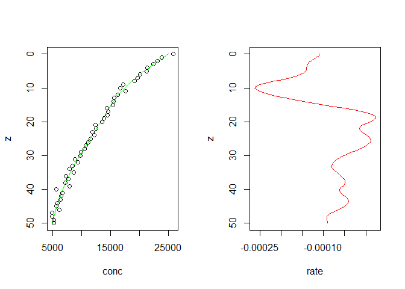

REC_R
================

This project translates algorithms implemented by **Rate Estimation from
Concentration (REC)** in matlab code into R code. Some minor changes to
the workflow are also implemented.

REC was originally developed by Karsten Lettmann ([Lettmann et
al. 2012](https://www.sciencedirect.com/science/article/abs/pii/S0272771411000229))
and can be downloaded
[here](https://uol.de/icbm/physikalische-ozeanographie-theorie/downloads).

## Preparing data

The matlab version requires data input from a ‘setup’, a folder
containing individual data files named \*\_C.txt, \*\_phi.txt,
\*\_omega.txt , \*\_beta.txt, \*\_D.txt, and \*\_Db.txt, all files
contain z (depth) values. This R version take as input a data frame with
columns `c(z, C, phi, omega, beta, D, Db)`. Setups can still be used and
data imported from them using the function `import_from_setup()`.
`import_from_setup()` takes as argument the path to a setup folder,
finds the required files in the setup folder and merges them based on z
(depth) values, but ignores all other files so that results (or other)
files could be saved in the setup without interfering with the import.
Columns z, C, phi and D have to be supplied and cannot be all zeros;
columns omega, beta, and Db may not be supplied and will then be
substituted with all zeros. *C* \[µM\] denotes concentration of the
water constituent. φ (phi) denotes the sediment porosity, ω (omega)
\[cm/s\] the sum of vertical pore water advection and the sedimentation
rate, *D* \[cm<sup>2</sup>/s\] the molecular diffusion coefficient
(valid for the specific sediment temperature and tortuosity),
*D<sub>B</sub>* (Db) \[cm<sup>2</sup>/s\] denotes the bioturbation
coefficient, β (beta) \[1/s\] the coefficient of irrigation.

Here we import data from the original example setup.

``` r
df <- import_from_setup("test_case_2_data_delta/")
head(df)
```

    ##   z       C  phi omega beta           D Db
    ## 1 0 25831.7 0.75     0    0 6.85714e-06  0
    ## 2 1 23875.8 0.75     0    0 6.85714e-06  0
    ## 3 2 23072.1 0.75     0    0 6.85714e-06  0
    ## 4 3 22366.1 0.75     0    0 6.85714e-06  0
    ## 5 4 21330.9 0.75     0    0 6.85714e-06  0
    ## 6 5 21222.0 0.75     0    0 6.85714e-06  0

## Running the main function

The example data is passed to the main function `rec()` as data frame.
`rec()` takes a number of arguments to guide the modeling of the
concentration profile and rates at a supplied depth resolution. The
function then interpolates input data to the required resolution, passes
them together with input arguments to a calculation function
`calculate_con_rates_lin_sys_Tikhonov_mean_rate_2()`, and compiles the
results for output as a named list. Internally,
`calculate_con_rates_lin_sys_Tikhonov_mean_rate_2()` calls a few other
functions.

``` r
test <- rec(original_data = df,
            recargs = NULL,          # data frame containing values for the input arguments; takes precedent over individual arguments
            N_c = 101,               # Number of computational grid points
            C_water = 25e3,          # concentration in water column (only important for irrigation) [µM]
            # parameters for Tikhonov regularization
            lambda = 1,              # 'smoothing' parameter lambda
            alpha_min = 8,           # lowest alpha value for Tikhonov regularisation and ratio criterion ( actually log_10(alpha_min) )
            alpha_max = 15,          # largest alpha value for Tikhonov regularisation and ratio criterion ( actually log_10(alpha_max) )
            N_alpha = 301,           # Number of ratio criterion evaluations in the alpha interval, to find the minimum
            # setting the boundary conditions for the concentration
            bnd_cond_type_z_min = 1, # type of boundary condition at the top: 1: for concentration / 2: for derivative
            bnd_cond_C_z_min = 25e3, # value of concentration or derivative at top [µM]
            bnd_cond_type_z_max = 1, # type of boundary condition at the bottom: 1: for concentration / 2: for derivative
            bnd_cond_C_z_max = 5e3   # value of concentration or derivative at bottom [µM]
            )
```

    ## Data interval for C is correct.
    ## Data interval for phi is correct.
    ## Data interval for omega is correct.
    ## Data interval for beta is correct.
    ## Data interval for D is correct.
    ## Data interval for Db is correct.
    ## Starting Tikhonov regularization
    ## Using Dirichlet boundary conditions for top boundary
    ## Using Dirichlet boundary conditions for bottom boundary
    ## ready with Tikhonov - Matrices: A and B
    ## finding optimal alpha with ratio criterion
    ## optimal alpha for Tikhonov regularization: 1584893192461.11

``` r
summary(test)
```

    ##                    Length Class      Mode   
    ## input_data           7    data.frame list   
    ## input_pars          10    -none-     list   
    ## interpol_data        7    data.frame list   
    ## output_data          3    data.frame list   
    ## alpha_opt            1    -none-     numeric
    ## alpha              301    -none-     numeric
    ## Tikhonov_criterium 301    -none-     numeric

The list contains the *input data* as a data frame; the *input
parameters* entered as arguments of `rec()` as a list; the interpolated
data (i.e., the input data at a depth resolution passed to `rec()` via
`N_c`, minus the z column) as a data frame; the output data of z in the
required resolution and the corresponding *interpolated concentrations*
and *calculated rates* as a data frame; the *optimum alpha* value; a
vector of all tested alpha values and a vector of corresponding Tikhonov
criterion values.

The arguments to `rec()` can also be passed by supplying to the argument
`recargs` a data frame containing the arguments as column names. If both
are supplied the data frame input will take precedent over the
individual input (by internally overwriting the arguments). This would,
for example, allow saving the input values for the arguments in a
separate file in a setup folder.

    ##   N_c C_water lambda alpha_min alpha_max N_alpha bnd_cond_type_z_min
    ## 1 101   25000      1         8        15     301                   1
    ##   bnd_cond_C_z_min bnd_cond_type_z_max bnd_cond_C_z_max
    ## 1            25000                   1             5000

## Visualize results

The function `plot_rec()` makes it easy to plot results for a quick
overview. It works on the output from `rec()`, so all plots (and more)
can also be produced directly from the output.

By default `plot_rec()` plots a two panel depth profile of input and
interpolated concentrations and calculated rates. The argument `type`
can be used to produce figures of the input data or of the Tikhonov
criterion as a function of alpha. The latter is useful to check if a
local minimum in the Tikhonov criterion was actually found and a
corresponding optimal alpha value used. This optimal alpha is shown on
the figure as a green dot. Printed output from `rec()` will also warn if
no local minimum was found and the (first occurrence of the) absolute
minimum is used as the location of the optimal alpha.

``` r
plot_rec(test)
```

<!-- -->

``` r
plot_rec(test, type = "localmin")
```

<!-- -->

``` r
plot_rec(test, type = "input")
```

<!-- -->

## Calculate boundary fluxes

Fluxes of the constituent of *C* across the upper and lower boundary of
the depth profile can be calculated with `boundary_fluxes()`. This is
useful e.g. in studies of benthic-pelagic coupling. The function accepts
the output of `rec()`. By default, an explanation of the calculation is
printed to the console, this can be suppressed by setting the argument
`explain = FALSE`.

``` r
boundary_fluxes(test)
```

    ## A flux is positive, if it is directed into positive z-direction (from top to bottom). 
    ## The diffusive flux is defined as: -phi * (D_effective + D_bio) * dC/dz 
    ## The advective flux is defined as: phi * omega * C 
    ## The total flux is the sum of the diffusive and the advective  flux. 
    ## All fluxes are given in: [cm * muM / s] 
    ## Or in related units, if not the standard unit system is used.

    ##    z    diffusive advective        total
    ## 1  0 0.0046003515         0 0.0046003515
    ## 2 50 0.0005314448         0 0.0005314448

## Calculate integrated rates

The rates of production of a constituent for *C* can be integrated using
`integrate_rates()`. The integration interval can be defined using the
`z_min` and `z_max` arguments but if no values for these are supplied,
rates will be integrated over the entire z range. By default, the
calculation will be explained as text printed to the console but this
can be suppressed by setting the argument `explain = FALSE`.

<!-- -->

``` r
integrate_rates(test)
```

    ## The depth integration is done by Simpson's Rule on the equidistant z-grid.  
    ## The unit of the integrated rate is: [nmol/(cm^2 s)] 
    ## Or in related units, if not the standard unit system is used.

    ## [1] -0.004068816

``` r
integrate_rates(test, z_min = 0, z_max = 30, explain = FALSE)
```

    ## [1] -0.002780434
